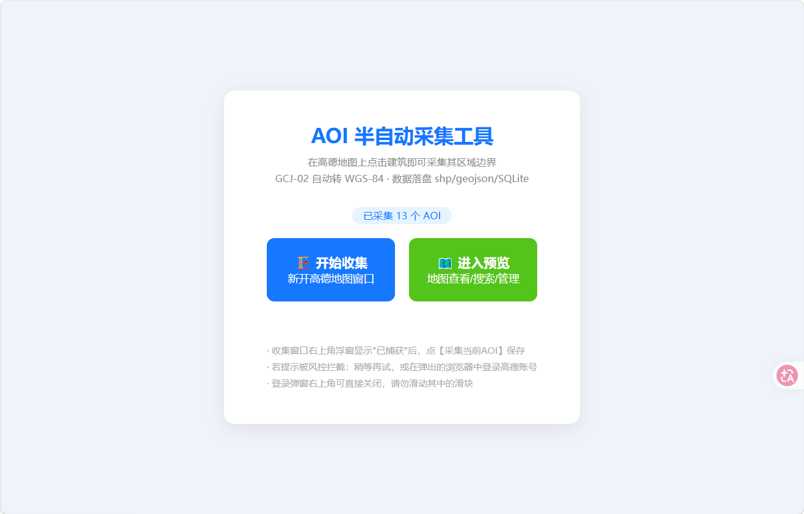
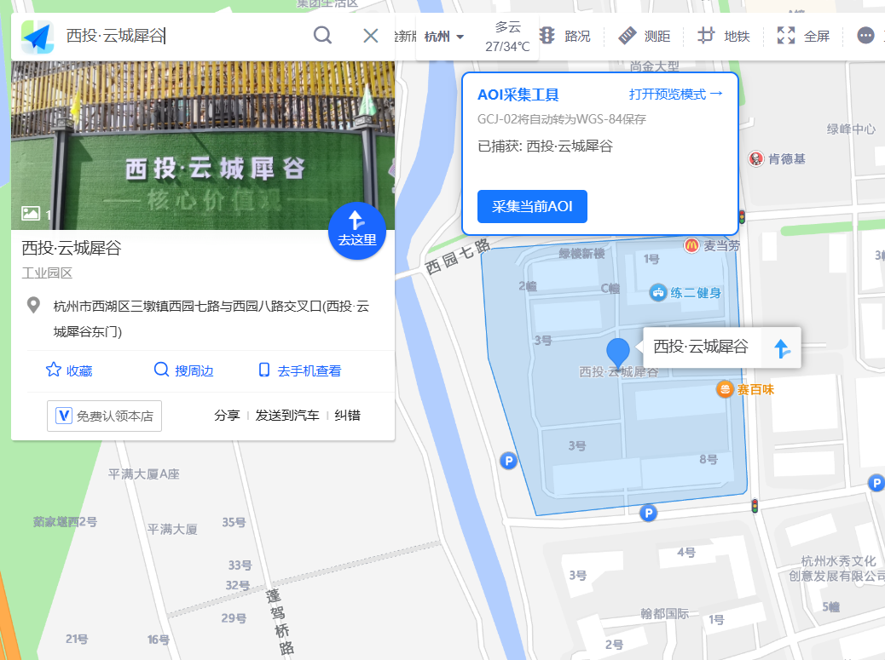
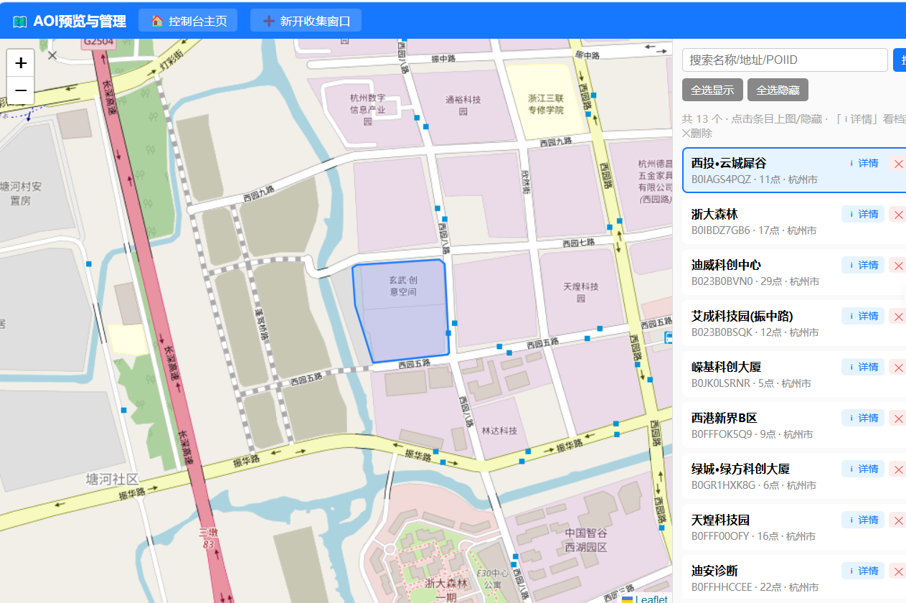

# AOI 半自动采集工具

从高德地图网页版**半自动**采集建筑物/园区的 AOI 面边界，自动完成 GCJ-02→WGS-84 坐标纠偏。

提供两种独立使用方式：

| 方式 | 部署 | 输出格式 | 适合场景 |
|------|------|---------|---------|
| **本地 Web 工具** | Python + Selenium | shp + GeoJSON + SQLite | 批量采集、需要 shp 格式 |
| **浏览器扩展** | Chrome/Edge 免安装 | GeoJSON | 轻量采集、随时可用 |





---

## 方式一：本地 Web 工具（FastAPI）

### 部署与启动

```bash
# 要求: Python 3.8+，系统已安装 Chrome/Edge/Chromium 其中之一
pip install -r requirements.txt
python app.py
```

启动后自动打开本地 Web 控制台（默认 `http://127.0.0.1:9224/`）。本目录完全自包含，整体拷贝到任意机器即可使用。

### 工作原理

1. 主页点击【开始收集】→ 自动打开一个真实浏览器窗口（Chrome/Edge/Chromium，自动检测）打开高德地图，并向页面注入采集浮窗；
2. 你在地图上正常搜索、点击任意建筑——高德会自动框出其区域边界，页面内部请求的 AOI 数据被浮窗**被动捕获**；
3. 点击浮窗【采集当前AOI】→ 坐标转换 → 保存落盘并入库。

所有网络请求均由你的真实浏览行为产生（浏览器风控 JS 自动签名），因此数据获取稳定可靠。

### 功能特性

- **跨平台跨浏览器**：自动检测 Windows/Mac/Linux 上的 Chrome/Edge/Chromium
- **一键采集**：浮窗显示"已捕获"后点一下按钮即保存
- **多格式输出**：每个 AOI 输出 shp 四件套 + geojson + 简介.txt 独立文件夹，同时写入 SQLite
- **同名覆盖**：同一 POI 重复采集直接覆盖旧数据
- **预览管理页**：Leaflet 地图展示全部已采集面，支持关键词搜索、单个/全部上图隐藏、拖拽定位、删除
- **详情弹窗**：预览页点击列表条目，弹出该建筑完整档案

### 采集结果结构

```
output/
└── 西投·云城犀谷/
    ├── 西投·云城犀谷.shp      # 多边形几何
    ├── 西投·云城犀谷.shx      # 空间索引
    ├── 西投·云城犀谷.dbf      # 属性表(NAME/ADDRESS/CITY_NAME/LONGITUDE/LATITUDE/POIID)
    ├── 西投·云城犀谷.prj      # 坐标系定义(WGS-84)
    ├── 西投·云城犀谷.geojson  # GeoJSON格式
    └── 简介.txt               # 名称/POIID/地址/点数/范围/完整边界坐标串
```

同时写入 `aoi.sqlite`（字段：名称、POIID、地址、城市、经纬度、范围、点数、坐标串、文件夹路径、采集时间）。

---

## 方式二：浏览器扩展（推荐）

免部署、免 Python 环境，适合轻量采集。

### 支持浏览器

Chrome 111+ 及所有 Chromium 内核浏览器（Edge、Brave、Opera 等）。Firefox、Safari 不支持。

### 安装

1. 打开 `chrome://extensions/`（或 `edge://extensions/`），右上角开启**开发者模式**
2. 点【加载已解压的扩展程序】，选择本项目的 `aoiCollectorJs/` 目录
3. 打开任意高德域名页面，右上角出现"AOI采集工具"浮窗即安装成功

**支持的域名**：`gaode.com`、`map.gaode.com`、`ditu.amap.com`、`map.amap.com`、`www.amap.com` 等全部高德系域名。

> 每次修改扩展代码或点刷新 ♻️ 后，已打开的高德页面需 F5 刷新才会重新注入。

### 使用流程

1. **点击建筑** → 浮窗显示"已捕获: xxx"
2. **点【采集当前AOI】** → 若尚未捕获边界，扩展会自动在搜索框执行一次搜索（走页面自身签名管线，不触发风控），拿到边界后自动保存
3. **点扩展图标** → 查看已采集列表、删除单条、导出 GeoJSON
4. **在线预览** → 点 popup 中的【预览】按钮，或把导出的 `.geojson` 文件拖入 [ky-gis 在线编辑器](https://ky-gis.com/zh/geojson-editor) 即可在地图上预览

### 数据存储

扩展数据保存在浏览器 **IndexedDB** 中：关闭浏览器后数据仍在，但删除扩展会连同数据一起删除，且扩展数据不属于 Chrome 同步范围。请及时导出 GeoJSON 备份。

### 技术要点（MV3）

- **双 content_scripts**：`hook.js` 以 `"world": "MAIN"` 注入页面主环境拦截 fetch/XHR；`content.js` 在隔离环境负责浮窗 UI 与消息通信，两者通过 `postMessage` 桥接
- **纯被动捕获 + 自动搜索**：不手动补发 API 请求（无风控签名会被 419 拦截），而是自动驱动页面自己的搜索框（原生 setter + 派发 input/Enter 事件）
- **Service Worker 保活**：`chrome.alarms` 每 30 秒触发；所有消息处理带 try-catch 防崩溃
- **导出在 popup 执行**：SW 无 `URL.createObjectURL`，文件下载在 popup 上下文完成

---

## 项目结构

```
aoiCollector/
├── app.py              # FastAPI 入口 (API + 静态文件)
├── browser.py          # Selenium 浏览器控制器 (跨平台自动探测)
├── static/
│   ├── index.html      # 控制台主页
│   ├── preview.html    # 预览/管理页
│   └── collect.js      # 注入高德页面的采集钩子+浮窗
├── aoiCollectorJs/     # Chrome/Edge 浏览器扩展 (MV3)
│   ├── manifest.json   # 扩展清单 (匹配 *.gaode.com + *.amap.com)
│   ├── background.js   # Service Worker (IndexedDB 存储 + 保存逻辑)
│   ├── hook.js         # MAIN world: fetch/XHR 拦截，提取 AOI 数据
│   ├── content.js      # 隔离环境: 浮窗 UI + 自动搜索触发
│   ├── popup.html      # 扩展弹窗界面
│   ├── popup.js        # 扩展弹窗逻辑 (列表/删除/GeoJSON导出/预览入口)
│   ├── libs/
│   │   └── coord.js    # GCJ-02 → WGS-84 坐标转换
│   └── icons/          # 扩展图标 (16/48/128px)
├── requirements.txt    # Python 依赖: fastapi, uvicorn, selenium, pyshp
├── aoi.sqlite          # SQLite 数据库 (Web 工具方式)
├── aoiCollectorJs.zip  # 扩展打包备份
└── output/             # 采集结果目录 (Web 工具方式, 约 50 个已采集 AOI)
```

## 注意事项

- **风控处理**：若浮窗提示"被风控拦截"或出现验证码，属正常现象。稍等几分钟再操作，或登录高德账号可大幅提升通过率
- **高德源数据脏 AOI**：个别 POI 的边界面本身是错位的（偏移十几公里）。采集时偏差 >800 米即在浮窗红色警告，可直接删除重采
- **正常系统差**：GCJ-02→WGS-84 坐标转换后，面心与基准点存在约 500~600 米系统差，这是正常表现，并非错误
